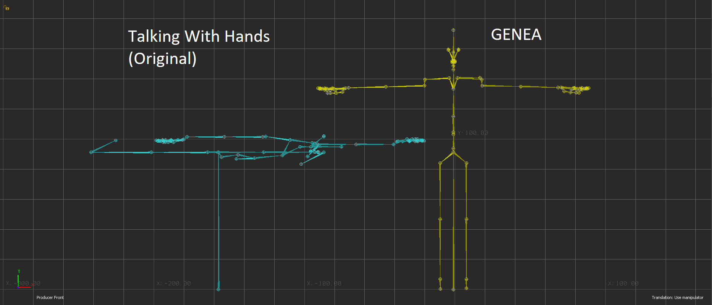

# Retargeting process
The raw data has skeletons that are defined according to an unconventional and contorted pose. We wanted to change that pose to the animation industry standard T-pose, as it is recognizable, easier to work with in 3D software, and expected to have better mathematical properties. To elaborate on the latter, the T-pose would lead to a better distribution over the joint rotation values due to its symmetry and closer resemblance to the poses found in the motion capture data. This in turn should reduce the chance of gimbal locking. We processed the data so that the animations are defined according to a T-posed skeleton, and not the original one.

  
   
  <i>Comparison between original and processed skeletal definition</i>

_Note: Gimbal locking is unavoidable when working with Euler angles. What matters is the rotation order of joints, the expected axis for rotation, and the distribution of rotation values around 0 per axis. For joints such as the knee, we expect one axis to rotate, and gimbal locking is not an issue there. However, joints like the shoulder and neck can rotate in all three axes, so rotation order and distribution of rotation values per axis will be more impactful. For more info on gimbal locking, check [this explanation](https://www.youtube.com/watch?v=zc8b2Jo7mno) or [this example in Maya](https://www.youtube.com/watch?v=mP7BzA8IdWw)._

# Scripts
`data_downsample.py`
This script downsamples the `.bvh` files from 90 fps to 30 fps. Under the hood, the script reads the `.bvh` files, deletes every 1st, 3rd, and 4th line, updates the time delta to 0.03333333 (30 fps) and saves a new `.bvh` file with a modified filename: `file.bvh` -> `file_30fps.bvh`

`_data_mobu_tpose_bvh.py`
This script is used in Autodesk MotionBuilder. It imports a BVH from the dataset containing animation data, and extracts a single-frame T-posed skeleton from it for further processing. The T-pose is extracted by importing an FBX file of an avatar which was already T-posed by an animator. By doing so, it was easy to extract a T-posed skeleton from the animation data by copying over the rotation values of the FBX skeleton to the BVH skeleton. The extracted BVH skeleton is then saved to disk temporarily.

`_data_maya_freeze_transforms.py`
This script is executed in Autodesk Maya. It imports the extracted BVH skeleton from the previous step, and "freezes" the rotation values for all bones. What this does is that the rotation values of the bones are set to 0, effectively updating the default pose of the skeleton to be a T-pose. The updated skeleton is saved to disk temporarily.

`_data_mobu_plot_bvh.py`
This script is executed in Autodesk MotionBuilder. It takes the updated T-posed skeleton for which all rotation values are 0. The script also imports a BVH file from the dataset for which the animation data should be retargeted onto a T-posed skeleton. For this, the BVH skeleton and the T-posed skeleton were both [characterized](https://help.autodesk.com/view/MOBPRO/2022/ENU/?guid=GUID-12F7FCD3-004E-45E9-85B3-E42C7C51B2F7) in MotionBuilder. This allowed realtime transfer of the animation data from one skeleton to another. Next, the retargeted animation was "baked" using MotionBuilder's `Plot` function, which captures the retargeted data and sets it as keyframes for the new skeleton. The new skeleton is then exported as a BVH file which contains the retargeted animation for the whole take.

*Note: The specifics of the retargeting algorithm is unclear as it is done internally inside MotionBuilder (the source code is not available). Theoretically, the process should be done using Forward Kinematics, as no Inverse Kinematic constraints were specified.*

*Note: The script can also normalize the animation data, centering the retargeted skeleton to world origin on average \[0,0,0\] and orienting the retargeted skeleton to look in the direction of positive Z axis on average (right-hand XYZ, Y-up).*

`data_standardization_pipeline.py`
This script launches Autodesk Maya and MotionBuilder, and passes the other scripts as launch arguments to the programs. This script is more like a user-interface, as you can specify various arguments to control the execution of the different pipeline stages above.

# Running the scripts
To reproduce the downsampling and retargeting processes, proceed as follows:

Step 1: **Clone the repository** on your computer somewhere.
- You may have done this already.
- Run `git clone https://github.com/TeoNikolov/genea_visualizer.git` in your terminal.

Step 2: Open terminal and **change your directory** to the `scripts\` directory.
- `cd ./genea_visualizer/scripts/`

Step 3: **Prepare** your motion data files.
- You can put them in the `scripts/data/` folder
- You can put them anywhere on your system. Make sure to specify the correct path when running the scripts (more below).
- There are example Talking With Hands `.bvh` data files already to test with.

Step 4: **Downsample** the motion data to 30 fps.
- Run `python data_downsample.py .\data` in your terminal.

Step 5: **Retarget** the motion data.
- Make sure you have [Maya](https://www.autodesk.com/products/maya/overview) and [MotionBuilder](https://www.autodesk.com/products/motionbuilder/overview) installed on your system.
- Run `python data_standardization_pipeline.py ./data "30fps.bvh" --tpose --freeze --retarget -b`. If your motion data files are not in the `scripts/data/` folder, change `./data` to the correct directory.
- You can also execute each step separately (useful for debugging issues):
	- `python data_standardization_pipeline.py ./data "30fps.bvh" --tpose -b`
	- `python data_standardization_pipeline.py ./data "30fps.bvh" --freeze -b`
	- `python data_standardization_pipeline.py ./data "30fps.bvh" --retarget -b`
- The `-b` flag prevents the Maya and MotionBuilder UI from opening, which will wait for you to close to continue with the other data processing stages. If there is a crash, you can disable this flag and check the console inside Maya and MotionBuilder for more information.
- If you want to normalize the root of the motion data, add the `--normalize-root` flag in your command.

*Note: In principle, it is possible to use the `_data_mobu_tpose_bvh.py`, `_data_maya_freeze_transforms.py`, and `_data_mobu_plot_bvh.py` script files directly without calling `data_standardization_pipeline.py`. However, this is discouraged because these files must be executed **inside MotionBuilder / Maya**, which means you need to work your way around the UI and console. You would also need to update the variables yourself. Unless you want to change things on a low-level, it is advised that you execute the scripts using `data_standardization_pipeline.py` instead with the flags you want `--tpose`, `--freeze` or `--retarget`.*
